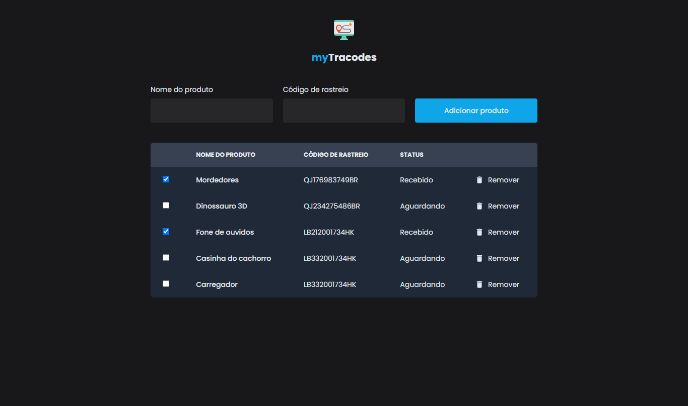

### myTracodes

Projeto desenvolvido com o objetivo de praticar um pouquinho de TailwindCSS e reforçar fundamentos do desenvolvimento de APIs com NodeJS.
Trata-se de uma aplicação bem simples na verdade, basicamente é uma tabela onde o usuário pode adicionar os códigos de rastreio de produtos comprados na internet para facilitar na hora de consultar o rastreio, evitando ter que acessar o site onde o produto foi comprado

### Funcionalidades
- Adicionar códigos de rastreio
- Apagar um código de rastreio
- Marcar um produto como recebido

### Tecnologias
- Node.js
- Express.js
- React
- TailwindCSS
- TypeScript
